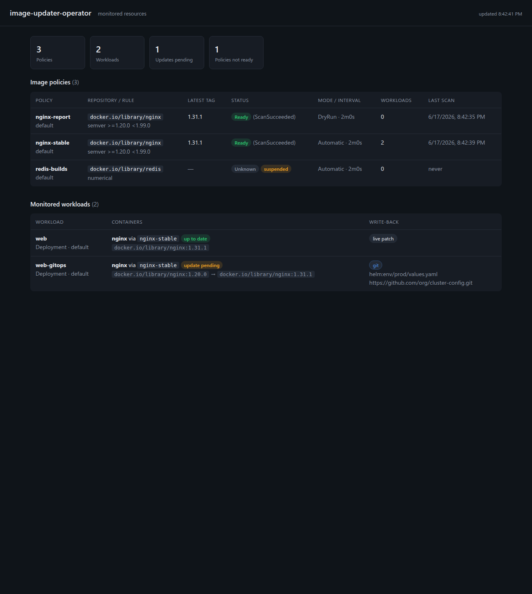

# image-updater-operator

A Kubernetes operator that keeps workload container images up to date by watching
external registries (Docker Hub, Nexus, Harbor, GHCR, ECR, and any Docker
Registry v2 compatible endpoint). Workloads opt in with annotations, and a single
annotation chooses how the update is applied: patch the live workload directly,
or commit the change to a Git repository so a GitOps controller (Argo CD, Flux,
or any other) syncs it. The Git write-back edits Helm values, Kustomize, or plain
manifest YAML in place, with no marker comments required. Selection rules support
semver ranges, regex with capture-group ordering, and pure numerical/alphabetical
ordering.

It is built with Kubebuilder and controller-runtime.

[Docs](https://phanindrasangers.github.io/image-updater-operator/) ·
[Roadmap](ROADMAP.md) ·
[Contributing](CONTRIBUTING.md) ·
[Code of Conduct](CODE_OF_CONDUCT.md) ·
[Security policy](SECURITY.md) ·
[Maintainers](MAINTAINERS.md)

## Contents

- [How it works](#how-it-works)
- [Write-back: live patch or Git](#write-back-live-patch-or-git)
- [Install](#install)
- [Quickstart](#quickstart)
- [Usage](#usage)
- [ImagePolicy reference](#imagepolicy-reference)
- [Git write-back reference](#git-write-back-reference)
- [Annotation reference](#annotation-reference)
- [Selection rules](#selection-rules)
- [Update modes](#update-modes)
- [Detection: polling and webhooks](#detection-polling-and-webhooks)
- [Registry authentication](#registry-authentication)
- [Examples](#examples)
- [Dashboard](#dashboard)
- [Observability and troubleshooting](#observability-and-troubleshooting)
- [Develop and run](#develop-and-run)
- [Testing](#testing)
- [Scripts](#scripts)
- [Releasing](#releasing)
- [Architecture](#architecture)

## How it works

Configuration is split across one CRD and a set of workload annotations.

An `ImagePolicy` defines a repository to scan and the rule used to pick the
winning tag. Its controller scans the registry on `spec.interval`, evaluates the
policy, and records the result in `status.latestImage` / `status.latestTag`.

A generic workload reconciler watches Deployments, StatefulSets, DaemonSets,
ReplicaSets, CronJobs, Pods, and Jobs. A workload opts in by annotating each
container with the policy it should track. When the referenced policy selects a
newer image, the operator either patches the container directly or commits the
change to Git, depending on the workload's `write-back` annotation.

```
                       scans on interval / webhook
   ImagePolicy  ─────────────────────────────────────►  registry (tags)
       │                                                      │
       │  status.latestImage = repo:selectedTag  ◄────────────┘
       ▼
   Deployment/STS/DS/RS/CronJob/Pod  ── annotation: policy.<container>
       │
       ├─ write-back: live (default) ──► container image patched in place
       └─ write-back: git           ──► commit to Git, GitOps controller syncs
```

Scanning happens once per policy and fans out to every workload that references
it, so many workloads can share one policy without multiplying registry calls.
Jobs are reported but not patched in live mode, because their pod template is
immutable after creation.

## Write-back: live patch or Git

The `write-back` annotation on the workload chooses how the selected image is
applied. The two methods are mutually exclusive per workload.

**`live` (default).** The operator patches the running workload's container
image. Use this when manifests are applied directly (`kubectl apply`, Helm
install) and nothing else owns the cluster state.

**`git`.** The operator clones the repository named in the workload's
annotations, edits the image in your YAML, commits, and pushes. A GitOps
controller then syncs the change. The operator never touches the live object.

This matters because a GitOps tool treats Git as the source of truth. If the
operator patched a live workload that Argo CD manages, Argo CD would mark the app
`OutOfSync` and, with self-heal on, revert the image. So for GitOps-managed
workloads you change Git and let the controller roll it out.

Git write-back is driven entirely by annotations on the workload. There are no
marker comments in your source. The `write-back-target` annotation names what to
edit, and the operator parses and rewrites that YAML in place, preserving
unrelated content and comments. Three target kinds are supported:

```yaml
# helm: set dotted keys in a values file (keys named per container)
image-updater.saphire.com/write-back-target: helm:env/prod/values.yaml
image-updater.saphire.com/helm.image-name.app: image.repository
image-updater.saphire.com/helm.image-tag.app: image.tag

# kustomize: upsert the images: entry whose name matches the repository
image-updater.saphire.com/write-back-target: kustomize:overlays/prod

# manifest: edit the container image field in a plain manifest
image-updater.saphire.com/write-back-target: manifest:apps/web/deployment.yaml
```

For helm targets, `helm.image-tag.<container>` is required and receives the
selected tag; `helm.image-name.<container>` is optional and receives the
repository. The dotted key addresses a position in the values file. A numeric
segment indexes into a list, so both map-form and array-form values are
supported:

```yaml
# map form: helm.image-tag.app = image.tag
image:
  repository: ghcr.io/org/app
  tag: 1.2.0

# array form: helm.image-tag.app = images.0.tag, helm.image-tag.proxy = images.1.tag
images:
  - repository: ghcr.io/org/app
    tag: 1.2.0
  - repository: ghcr.io/org/proxy
    tag: 4.5.0
```

Multiple images in one file are handled by giving each container its own
`helm.image-name.<container>` / `helm.image-tag.<container>` keys pointing at its
own location. Missing intermediate maps are created; a list index must already
exist. For kustomize, the operator sets `newTag` on the `images:` entry matching
the policy's `imageRepository`, adding the entry if absent. For manifest, it sets
every container whose `image` references the repository to `<repository>:<tag>`,
across all documents in the file (scope to one container by name with the
`<container>` it is bound to). Commits are idempotent: once Git already carries
the selected tag, reconciles make no further commits.

## Install

Requires a cluster and `kubectl`. Install the CRD and the controller:

```sh
# 1. Install the CRD
make install

# 2a. Run the controller locally against your current kube context (dev)
make run

# 2b. Or build an image and deploy it into the cluster (prod)
make docker-build docker-push IMG=<registry>/image-updater-operator:tag
make deploy IMG=<registry>/image-updater-operator:tag
```

`make deploy` installs the controller into the `image-updater-operator-system`
namespace with the RBAC it needs (read/patch on the supported workload kinds,
read on Secrets, and full access to `imagepolicies`).

## Quickstart

Track the latest 1.x of nginx and have a Deployment follow it automatically.

```sh
kubectl apply -f - <<'EOF'
apiVersion: images.saphire.com/v1alpha1
kind: ImagePolicy
metadata:
  name: nginx-stable
spec:
  imageRepository: docker.io/library/nginx
  interval: 5m
  updateMode: Automatic
  policy:
    semver:
      range: ">=1.0.0 <2.0.0"
---
apiVersion: apps/v1
kind: Deployment
metadata:
  name: web
  annotations:
    image-updater.saphire.com/policy.app: nginx-stable
spec:
  replicas: 1
  selector: { matchLabels: { app: web } }
  template:
    metadata: { labels: { app: web } }
    spec:
      containers:
        - name: app
          image: docker.io/library/nginx:1.0.0
EOF

# Watch the policy resolve a tag, then the deployment get patched
kubectl get imagepolicy nginx-stable -w
kubectl get deploy web -o jsonpath='{.spec.template.spec.containers[0].image}'
```

The container named `app` is bound to the `nginx-stable` policy. Once the policy
scans and selects the highest 1.x tag, the operator patches
`web`'s `app` container to that image and records an `ImageUpdated` event.

## Usage

Every workflow starts with an `ImagePolicy` that defines what to scan and how to
pick the winning tag. From there you choose how the update is applied. The four
recipes below cover the common cases. Field-level detail is in the reference
sections that follow.

### Patch a live workload

For workloads applied directly (`kubectl apply`, Helm install) and not managed by
a GitOps tool. Create the policy, then bind each container to it with a
`policy.<container>` annotation on the workload. The operator patches the live
object in place. This is the flow shown in the [Quickstart](#quickstart).

```yaml
metadata:
  annotations:
    image-updater.saphire.com/policy.app: nginx-stable
```

### Write the update to Git

For workloads whose source of truth is Git and that are synced by a GitOps
controller. Set `write-back: git` and tell the operator which repo, credentials,
and YAML to edit, all through annotations. The operator commits the new image and
the GitOps controller rolls it out, so the live object is never patched directly.

First create a Secret with the Git credentials in the workload's namespace:

```sh
kubectl create secret generic git-https \
  --from-literal=username=git \
  --from-literal=password=<personal-access-token>
```

Then annotate the workload. This example edits a Helm values file:

```yaml
metadata:
  annotations:
    image-updater.saphire.com/policy.app: app-stable
    image-updater.saphire.com/write-back: git
    image-updater.saphire.com/git-repo: https://github.com/org/app-config.git
    image-updater.saphire.com/git-branch: main
    image-updater.saphire.com/git-secret: git-https
    image-updater.saphire.com/write-back-target: helm:env/prod/values.yaml
    image-updater.saphire.com/helm.image-name.app: image.repository
    image-updater.saphire.com/helm.image-tag.app: image.tag
```

Swap `write-back-target` for `kustomize:<dir>` or `manifest:<file>` to edit those
layouts instead. See [Write-back](#write-back-live-patch-or-git) for the per-kind
behavior and why live patch and Git write-back are mutually exclusive.

### Require approval before updating

Set the policy to `Approval` mode, or override per workload with the
`update-mode` annotation. The operator records the candidate and emits an
`ApprovalRequired` event instead of patching. Approve the candidate to release it.

```sh
kubectl annotate deploy web \
  image-updater.saphire.com/approve.app=1.4.0 --overwrite
```

### Report updates without applying them

Set `DryRun` mode to surface available updates as `UpdateAvailable` events while
leaving the workload untouched. Useful for sensitive workloads or for evaluating
a policy before trusting it.

```yaml
metadata:
  annotations:
    image-updater.saphire.com/policy.app: app-stable
    image-updater.saphire.com/update-mode: DryRun
```

## ImagePolicy reference

`apiVersion: images.saphire.com/v1alpha1`, `kind: ImagePolicy` (namespaced).
A workload references a policy in its own namespace.

| Field | Type | Required | Default | Description |
|-------|------|----------|---------|-------------|
| `spec.imageRepository` | string | yes | | Repository to scan, no tag. e.g. `docker.io/library/nginx`, `ghcr.io/org/app`, `<acct>.dkr.ecr.<region>.amazonaws.com/app`. Bound containers are set to `<imageRepository>:<selectedTag>`. |
| `spec.policy` | object | yes | | The selection rule. Set exactly one of `semver`, `regex`, `numerical`, `alphabetical`. |
| `spec.filterTags.pattern` | string (regex) | no | | Pre-filter applied to the tag list before the policy runs. |
| `spec.interval` | duration | no | `5m` | Scan cadence. Clamped to a 30s minimum. |
| `spec.updateMode` | enum | no | `Automatic` | `Automatic`, `Approval`, or `DryRun`. Overridable per workload. |
| `spec.registryRef.secretName` | string | no | | `kubernetes.io/dockerconfigjson` Secret in the policy's namespace. Omit to use ambient credentials. |
| `spec.registryRef.insecure` | bool | no | `false` | Allow plain HTTP. Use only for trusted in-cluster registries. |
| `spec.suspend` | bool | no | `false` | Pause scanning and updates for this policy. |

Status (read-only):

| Field | Description |
|-------|-------------|
| `status.latestTag` | Tag selected at the last successful scan. |
| `status.latestImage` | Full `repository:tag` applied to bound containers. |
| `status.lastScanTime` | Timestamp of the last successful scan. |
| `status.scannedTags` | Number of tags the registry returned. |
| `status.conditions[Ready]` | `True` after a successful scan, `False` with a reason on error (`AuthError`, `ScanError`, `PolicyError`, `NoMatch`). |

## Git write-back reference

Git write-back is configured by annotations on the workload, all prefixed
`image-updater.saphire.com/`. There is no Git CRD. When `write-back: git` is
set, the operator clones the repo, edits the target YAML, commits, and pushes on
each reconcile, committing only when the selected tag is not already present.

| Annotation | Required | Default | Description |
|------------|----------|---------|-------------|
| `write-back` | no | `live` | `live` patches the running workload; `git` commits to a repository. |
| `git-repo` | for git | | Clone URL. HTTPS (`https://host/org/repo.git`) or SSH (`git@host:org/repo.git`). |
| `git-branch` | no | `main` | Branch to read and write. |
| `git-secret` | no | | Secret in the workload's namespace holding Git credentials. Omit for public HTTPS repos. |
| `write-back-target` | for git | | `helm:<file>`, `kustomize:<dir>`, or `manifest:<file>`, relative to the repo root. |
| `helm.image-tag.<container>` | for helm | | Dotted values key that receives the selected tag, e.g. `image.tag` or `images.0.tag`. A numeric segment indexes a list. |
| `helm.image-name.<container>` | no | | Dotted values key that receives the repository, e.g. `image.repository`. |
| `git-commit-message` | no | built-in | Go template for the commit message. See the template context below. |
| `git-author-name` | no | `image-updater-operator` | Committer name. |
| `git-author-email` | no | `image-updater@saphire.com` | Committer email. |

The commit message is a Go template. When `git-commit-message` is unset, the
default is `chore(images): update <name>` followed by one body line per changed
container (`<container>: <old> -> <new> (<file>)`). The template context is:

| Field | Description |
|-------|-------------|
| `.Name`, `.Namespace`, `.Kind` | The workload being updated. |
| `.Changes` | List of edits, each with `.File`, `.Container`, `.Repository`, `.Tag`, `.Image`, `.OldImage`. |
| `.Container`, `.Repository`, `.Tag`, `.Image`, `.OldImage` | Convenience fields mirroring the first change, for the common single-image case. |

```yaml
image-updater.saphire.com/git-commit-message: |
  ci: bump {{.Container}} to {{.Tag}}

  {{range .Changes}}- {{.File}}: {{.Image}}
  {{end}}
```

An invalid template records a `CommitTemplateError` warning and falls back to
the default rather than blocking the write-back. On error the operator records
an event on the workload: `CloneError`, `AuthError`, `PushError`,
`WriteBackError`, or `WriteBackMisconfigured`. A successful push records
`ImageCommitted` with the commit SHA.

The credential Secret matches the clone URL scheme. HTTPS:

```sh
kubectl create secret generic git-https \
  --from-literal=username=git \
  --from-literal=password=<personal-access-token>   # or key "token"
```

SSH:

```sh
kubectl create secret generic git-ssh \
  --from-file=identity=$HOME/.ssh/id_ed25519 \
  --from-file=known_hosts=$HOME/.ssh/known_hosts
```

## Annotation reference

All keys use the prefix `image-updater.saphire.com/`. They go on the workload
object (Deployment, StatefulSet, and so on), not on the pod template.

| Annotation | Value | Purpose |
|------------|-------|---------|
| `policy.<container>` | ImagePolicy name | Bind a container to a policy. The suffix is the container name; works for regular, init, and sidecar containers. Repeat the key per container. |
| `update-mode` | `Automatic` \| `Approval` \| `DryRun` | Override the policy's update mode for this workload. |
| `approve.<container>` | a tag, e.g. `"1.4.0"` | In `Approval` mode, approve the named candidate tag for that container. |
| `last-updated.<container>` | set by the operator | Records the last image the operator wrote for that container in live mode (auditing). |
| `write-back` | `live` \| `git` | Apply the update by live patch (default) or Git commit. |
| `git-repo` | clone URL | Repository to write to when the method is `git`. |
| `git-branch` | branch name | Branch to read and write. Defaults to `main`. |
| `git-secret` | Secret name | Git credentials in the workload's namespace. |
| `write-back-target` | `kind:path` | YAML to edit: `helm:<file>`, `kustomize:<dir>`, or `manifest:<file>`. |
| `helm.image-name.<container>` | dotted key | For helm targets, the values key holding the repository. |
| `helm.image-tag.<container>` | dotted key | For helm targets, the values key holding the tag. |

## Selection rules

Set exactly one of the following under `spec.policy`:

| Rule | Fields | Behavior |
|------|--------|----------|
| `semver` | `range` | Highest tag satisfying the constraint. A leading `v` is stripped before parsing, so `v1.10` is treated as `1.10.0`. |
| `regex` | `pattern`, `extract`, `numeric`, `order` | Keep tags matching `pattern`, optionally rewrite each via `extract` (`$1` capture syntax), sort lexically or numerically, take the `asc`/`desc` endpoint. |
| `numerical` | `order` | Natural-numeric ordering of all tags (so `9` sorts before `10`). |
| `alphabetical` | `order` | Lexical ordering of all tags. |

`order` defaults to `desc` (newest/highest first). `spec.filterTags.pattern`
optionally narrows candidates before the rule runs.

## Update modes

`spec.updateMode`, overridable per workload via the `update-mode` annotation:

- `Automatic` patches the workload as soon as a newer tag is selected.
- `Approval` records the candidate and emits an `ApprovalRequired` event; the
  workload is patched only once it carries
  `image-updater.saphire.com/approve.<container>: "<tag>"` matching the candidate.
- `DryRun` reports the available update via an `UpdateAvailable` event but never
  patches.

## Detection: polling and webhooks

Polling is always on (`spec.interval`, 30s minimum). In addition, the operator
serves a webhook receiver (default `:9090`) that triggers an immediate re-scan of
the affected policies on a registry push event:

- `POST /webhook/dockerhub`
- `POST /webhook/harbor`
- `POST /webhook/generic` — body `{"repository":"host/repo"}` or `{"image":"host/repo:tag"}`

Set `WEBHOOK_RECEIVER_TOKEN` to require `Authorization: Bearer <token>`. Disable
the receiver with `--enable-webhook-receiver=false`. The receiver maps the pushed
repository to matching policies and forces their reconcile.

## Registry authentication

Reference a `kubernetes.io/dockerconfigjson` Secret (the same shape as an
`imagePullSecret`) via `spec.registryRef.secretName`. When omitted, the operator
falls back to the ambient default keychain, which is how ECR/GCR/ACR credential
helpers and cloud workload identity (for example IRSA on EKS) surface
credentials. Use `spec.registryRef.insecure: true` only for trusted in-cluster
registries served over plain HTTP.

Per-registry setup (Docker Hub, GHCR, Nexus, JFrog, ECR, GCR/ACR) is documented
in [TESTING.md](TESTING.md#running-against-a-real-registry).

## Examples

Init and sidecar containers, each on its own policy:

```yaml
metadata:
  annotations:
    image-updater.saphire.com/policy.migrate: db-migrate-stable   # init container
    image-updater.saphire.com/policy.app: app-stable              # main container
    image-updater.saphire.com/policy.proxy: envoy-stable          # sidecar
```

Report-only (no patching) for a sensitive workload:

```yaml
metadata:
  annotations:
    image-updater.saphire.com/policy.app: app-stable
    image-updater.saphire.com/update-mode: DryRun
```

Git write-back into an array-form Helm values file, two images in one file:

```yaml
metadata:
  annotations:
    image-updater.saphire.com/policy.app: app-stable
    image-updater.saphire.com/policy.proxy: envoy-stable
    image-updater.saphire.com/write-back: git
    image-updater.saphire.com/git-repo: https://github.com/org/cfg.git
    image-updater.saphire.com/git-secret: git-https
    image-updater.saphire.com/write-back-target: helm:env/prod/values.yaml
    image-updater.saphire.com/helm.image-name.app: images.0.repository
    image-updater.saphire.com/helm.image-tag.app: images.0.tag
    image-updater.saphire.com/helm.image-name.proxy: images.1.repository
    image-updater.saphire.com/helm.image-tag.proxy: images.1.tag
```

Track the highest numeric build tag (latest-style), ignoring non-numeric tags:

```yaml
spec:
  policy:
    numerical: { order: desc }
```

Date-stamped nightly builds, newest first:

```yaml
spec:
  filterTags: { pattern: '^nightly-' }
  policy:
    regex: { pattern: '^nightly-(\d{8})$', extract: "$1", numeric: true, order: desc }
```

Approve a staged update:

```sh
# Approval-mode policy raised an ApprovalRequired event with candidate 1.4.0
kubectl annotate deploy web \
  image-updater.saphire.com/approve.app=1.4.0 --overwrite
```

## Dashboard

The operator serves a read-only web dashboard (default `:8082`) that shows what
it is monitoring: every ImagePolicy with its selected tag, readiness, scan time,
and how many workloads reference it; and every annotated workload with its
containers, current versus desired image, update state, and write-back method
(live or git). It polls its own JSON API (`GET /api/overview`) every few seconds.



The dashboard is read-only and queries the controller's cached client, so it adds
no extra API-server load and needs no permissions beyond what the controllers
already hold. It runs on every replica (independent of leader election). Disable
it with `--enable-dashboard=false` or change the port with
`--dashboard-bind-address`.

Running locally with `make run`, open http://localhost:8082/. In a cluster, reach
it with a port-forward (or set `dashboard.service.enabled=true` in the Helm chart):

```sh
kubectl -n image-updater-system port-forward deploy/image-updater-operator 8082:8082
# then open http://localhost:8082/
```

## Observability and troubleshooting

```sh
# Is the policy resolving a tag?
kubectl get imagepolicy
kubectl get imagepolicy <name> -o jsonpath='{.status}' | jq

# Why did a workload not update? Read the events on the policy and the workload.
kubectl describe imagepolicy <name>
kubectl get events --field-selector involvedObject.name=<workload>
```

Common signals:

- `status.conditions[Ready] = False` with `AuthError` or `ScanError`: bad or
  missing credentials, wrong `imageRepository`, or the registry is unreachable.
- `NoMatch`: the registry returned tags but none satisfied the policy or
  `filterTags`. Check the `range`/`pattern`.
- Workload shows `ApprovalRequired` and does not change: the policy is in
  `Approval` mode; set the `approve.<container>` annotation.
- A `Job` shows `ImmutableWorkload`: Jobs cannot be patched after creation;
  recreate the Job to pick up the new image.

## Develop and run

Requires Go 1.25 (the version in `go.mod`), kubebuilder, and a cluster (kind
works well). If your installed Go differs, you do not need to switch it manually:
with the default `GOTOOLCHAIN=auto`, the Go command reads the `go 1.25.0`
directive in `go.mod` and downloads a matching toolchain on demand. A newer Go
also works. To pin explicitly, set `GOTOOLCHAIN=go1.25.5`; to forbid the
auto-download (for example in an air-gapped build), set `GOTOOLCHAIN=local` and
install Go 1.25 yourself.

```sh
make manifests generate   # regenerate CRDs and deepcopy after API changes
make test                 # unit tests + envtest
make install              # install CRDs into the current cluster
make run                  # run the manager locally against the current kube context
```

### Build the container image

The [Dockerfile](Dockerfile) is a two-stage build: it compiles a static binary
with `CGO_ENABLED=0` on `golang:1.25`, then ships it on `gcr.io/distroless/static:nonroot`.
`IMG` selects the tag for build, push, and deploy:

```sh
make docker-build docker-push IMG=<registry>/image-updater-operator:<tag>
make deploy IMG=<registry>/image-updater-operator:<tag>   # apply to the cluster
```

For a multi-architecture image (the build passes `TARGETOS`/`TARGETARCH` to the
compiler), use the buildx target:

```sh
make docker-buildx IMG=<registry>/image-updater-operator:<tag>
```

## Testing

See [TESTING.md](TESTING.md). For a fully reproducible end-to-end run against a
local registry in kind:

```sh
hack/e2e-local.sh                # live patch: Automatic, webhook, and Approval flows
hack/e2e-git-writeback.sh        # git write-back: commit a selected tag to a Helm values file
# add --cleanup to either to tear down the cluster and registry afterwards
```

`e2e-local.sh` verifies the Automatic, webhook-triggered, and Approval live-patch
flows. `e2e-git-writeback.sh` verifies that `write-back: git` commits the selected
tag into a values file in a local bare repo and leaves the live workload
untouched. TESTING.md also documents pointing the operator at ECR, GHCR, Nexus,
JFrog, and Docker Hub.

## Scripts

Helper scripts live in [hack/](hack/). Both spin up a throwaway kind cluster and
a local registry, run the operator, exercise a flow end to end, and assert the
result. Pass `--cleanup` to tear the cluster and registry down afterwards.

| Script | What it does |
|--------|--------------|
| [hack/e2e-local.sh](hack/e2e-local.sh) | Live-patch end to end: pushes tagged images, then verifies Automatic updates, a webhook-triggered re-scan, and Approval-mode gating against an annotated Deployment. |
| [hack/e2e-git-writeback.sh](hack/e2e-git-writeback.sh) | Git write-back end to end: seeds a bare repo with a Helm values file, then verifies the operator commits the selected tag to Git, never patches the live workload, and is idempotent. Uses `file://` so no Git server or network is needed. |

```sh
hack/e2e-local.sh --cleanup
hack/e2e-git-writeback.sh --cleanup
```

## Releasing

A release is published by pushing a semver tag. The
[release workflow](.github/workflows/release.yml) then builds the multi-arch
container image and pushes it, plus the packaged Helm chart, to GitHub Packages
(GHCR) using the built-in `GITHUB_TOKEN`. No registry credentials are needed.

```sh
git tag v0.1.0
git push origin v0.1.0
```

This publishes:

- `ghcr.io/<owner>/image-updater-operator:0.1.0` and `:latest` (the operator image)
- `ghcr.io/<owner>/charts/image-updater-operator:0.1.0` (the Helm chart, OCI)

Pull the chart with `helm pull oci://ghcr.io/<owner>/charts/image-updater-operator --version 0.1.0`.
New packages are private by default; make them public from the repository's
Packages page if you want anonymous pulls.

## Architecture

| Package | Responsibility |
|---------|----------------|
| `api/v1alpha1` | `ImagePolicy` CRD types |
| `internal/policy` | Tag selection (semver/regex/numeric/alpha) |
| `internal/registry` | Tag listing via go-containerregistry, dockerconfigjson keychain |
| `internal/workload` | Annotation contract (policy binding and write-back) and per-kind pod-spec adapters |
| `internal/gitwriteback` | YAML target editors (helm/kustomize/manifest) and git clone/commit/push |
| `internal/controller` | `ImagePolicy` scan loop and the generic workload reconciler (live patch and Git write-back) |
| `internal/webhook` | Registry push-event receiver and the repository field index |
