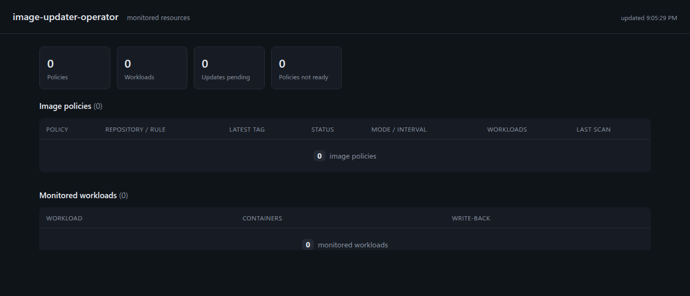

# Dashboard

The operator serves a built-in, read-only dashboard that shows every `ImagePolicy` and the workloads it monitors, including each container's current and desired image.


When nothing is configured yet, tables render a clear zero state rather than an error:



## Enabling

The dashboard server runs inside the pod by default (`dashboard.enabled: true`) on port 8082. It is read-only and does not require leader election, so every replica serves it.

A `Service` is created when `dashboard.service.enabled: true`:

```sh
helm upgrade image-updater oci://ghcr.io/phanindrasangers/charts/image-updater-operator \
  --version 0.2.0 -n image-updater-system --reuse-values \
  --set dashboard.service.enabled=true
```

## Accessing it

The Service is `ClusterIP`, so reach it with a port-forward:

```sh
kubectl port-forward -n image-updater-system \
  svc/image-updater-image-updater-operator-dashboard 8082:8082
# open http://localhost:8082
```

Without the Service, port-forward straight to the Deployment:

```sh
kubectl port-forward -n image-updater-system \
  deploy/image-updater-image-updater-operator 8082:8082
```

To expose it without forwarding, set `dashboard.service.type` to `NodePort` or `LoadBalancer`.

## API

The UI is backed by a single JSON endpoint, handy for scripting:

```sh
curl -s http://localhost:8082/api/overview | jq
```

It returns the policies and the monitored workloads, with per-container `currentImage`, `desiredImage`, and `upToDate`. Controller-owned objects (a Deployment's ReplicaSets and Pods) are excluded so each logical workload appears once.
